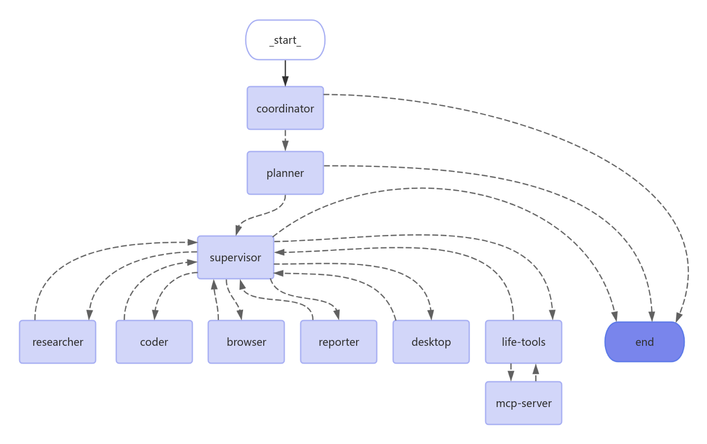

# BuptManus

[](https://www.python.org/downloads/)

[English](./README.md) | [简体中文](./README_zh.md)

> 源于开源，回馈开源

BUPTManus 是一个基于多智能体的 AI 自动化框架，它建立在开源社区的卓越工作基础之上。我们的目标是将语言模型与专业工具（如网络搜索、爬虫和 Python 代码执行）相结合，打造一个自动化的通用智能体。

## 演示视频

- 📦 [下载演示视频 (MP4)](https://github.com/langmanus/langmanus/blob/main/assets/demo.mp4)

## 目录
- [快速开始](#快速开始)
- [架构](#架构)
- [功能特性](#功能特性)
- [安装设置](#安装设置)
    - [前置要求](#前置要求)
    - [安装步骤](#安装步骤)
    - [Docker 部署(**选用:无法自动化本地浏览器或者对文件系统进行操作**)](#docker-部署)
    - [配置](#配置)
- [后端服务器](#后端服务器)
- [前端网页界面](#前端网页界面)
- [开发](#开发)
- [贡献](#贡献)
- [致谢](#致谢)

## 快速开始

```bash
# 导向目录
cd BuptManus

# 用uv创建并激活虚拟环境
uv python install 3.12
uv venv --python 3.12

source .venv/bin/activate  # Windows系统使用: .venv\Scripts\activate

# 安装依赖
uv sync

# 配置环境
cp .env.example .env
# 编辑 .env 文件，填入你的 API 密钥
```

### 浏览器依赖安装

BuptManus 支持多种浏览器自动化方案，推荐使用 Playwright：

```bash
# 安装 Playwright 浏览器
playwright install

# 或者只安装 Chromium（推荐）
playwright install chromium

# 验证安装
playwright --version

# 运行项目
uv run main.py
```

## 架构

BUPTManus 实现了一个分层的多智能体系统，其中有一个主管智能体协调专门的智能体来完成复杂任务：



系统由以下智能体协同工作：

1. **协调员（Coordinator）**：工作流程的入口点，处理初始交互并路由任务
2. **规划员（Planner）**：分析任务并制定执行策略
3. **主管（Supervisor）**：监督和管理其他智能体的执行
4. **研究员（Researcher）**：收集和分析信息
5. **程序员（Coder）**：负责代码生成和修改
6. **浏览器（Browser）**：执行网页浏览和信息检索
7. **汇报员（Reporter）**：生成工作流结果的报告和总结
8. **日常工具（Life-Tool）**：通过调用 Mcp-Server 中的工具提供天气查询、快递追踪等生活服务，将技术接口转换为自然语言回答,拓展性强

## 功能特性

### 核心能力
- 🤖 **LLM 集成**
    - 支持通义千问等开源模型
    - OpenAI 兼容的 API 接口
    - 多层 LLM 系统适配不同任务复杂度

### 工具和集成
- 🔍 **搜索和检索**
    - 通过 Tavily API 进行网络搜索
    - 使用 Jina 进行神经搜索
    - 高级内容提取

### 开发特性
- 🐍 **Python 集成**
    - 内置 Python REPL
    - 代码执行环境
    - 使用 uv 进行包管理

### 工作流管理
- 📊 **可视化和控制**
    - 工作流程图可视化
    - 多智能体编排
    - 任务分配和监控

## 安装设置

### 前置要求

- [uv](https://github.com/astral-sh/uv) 包管理器

### 安装步骤

BUPTManus 使用 [uv](https://github.com/astral-sh/uv) 作为包管理器以简化依赖管理。
按照以下步骤设置虚拟环境并安装必要的依赖：

```bash
# 步骤 1：用uv创建并激活虚拟环境
uv python install 3.12
uv venv --python 3.12

# Unix/macOS 系统：
source .venv/bin/activate

# Windows 系统：
.venv\Scripts\activate

# 步骤 2：安装项目依赖
uv sync

# 步骤 3：安装浏览器自动化依赖
playwright install
```

### Docker 部署
- **选用:无法自动化本地浏览器或者对文件系统进行操作**
- 使用 Docker 可以快速部署 BuptManus，无需手动配置环境：

```bash
# 构建 Docker 镜像
docker build -t buptmanus .

# 运行容器
docker run -d \
  --name buptmanus \
  -p 3000:3000 \
  -v $(pwd)/.env:/app/.env \
  buptmanus

# 或者使用 docker-compose
docker-compose up -d
```

### 配置

BUPTManus 使用三层 LLM 系统，分别用于推理、基础任务和视觉语言任务。在项目根目录创建 `.env` 文件并配置以下环境变量：

```ini
# 推理 LLM 配置（用于复杂推理任务）
REASONING_MODEL=your_reasoning_model
REASONING_API_KEY=your_reasoning_api_key
REASONING_BASE_URL=your_custom_base_url  # 可选

# 基础 LLM 配置（用于简单任务）
BASIC_MODEL=your_basic_model
BASIC_API_KEY=your_basic_api_key
BASIC_BASE_URL=your_custom_base_url  # 可选

# 视觉语言 LLM 配置（用于涉及图像的任务）
VL_MODEL=your_vl_model
VL_API_KEY=your_vl_api_key
VL_BASE_URL=your_custom_base_url  # 可选

# 工具 API 密钥
TAVILY_API_KEY=your_tavily_api_key
JINA_API_KEY=your_jina_api_key  # 可选

# 浏览器配置
CHROME_INSTANCE_PATH=/Applications/Google Chrome.app/Contents/MacOS/Google Chrome  # 可选，Chrome 可执行文件路径
```

> **注意：**
>
> - 系统对不同类型的任务使用不同的模型：
>     - 推理 LLM 用于复杂的决策和分析
>     - 基础 LLM 用于简单的文本任务
>     - 视觉语言 LLM 用于涉及图像理解的任务
> - 所有 LLM 的基础 URL 都可以独立自定义
> - 每个 LLM 可以使用不同的 API 密钥
> - Jina API 密钥是可选的，提供自己的密钥可以获得更高的速率限制（你可以在 [jina.ai](https://jina.ai/) 获该密钥）
> - Tavily 搜索默认配置为最多返回 5 个结果（你可以在 [app.tavily.com](https://app.tavily.com/) 获取该密钥）

您可以复制 `.env.example` 文件作为模板开始：

```bash
cp .env.example .env
```

## 后端服务器

### 基本执行

使用默认设置运行 BUPTManus：

```bash
uv run main.py
```

### API 服务器

BUPTManus 提供基于 FastAPI 的 API 服务器，支持流式响应：

```bash
# 启动 API 服务器
make serve

# 或直接运行
uv run server.py
```

API 服务器提供以下端点：

- `POST /api/chat/stream`：用于 LangGraph 调用的聊天端点，流式响应
    - 请求体：
    ```json
    {
      "messages": [
        {"role": "user", "content": "在此输入您的查询"}
      ],  
      "debug": false
    }
    ```
    - 返回包含智能体响应的服务器发送事件（SSE）流

- `GET /api/chat/sessions`：获取用户的所有聊天会话
    - 返回会话数组，包含ID、标题、创建时间等信息

- `POST /api/chat/sessions`：创建新的聊天会话
    - 请求体：
    ```json
    {
      "title": "可选的会话标题"
    }
    ```

- `DELETE /api/chat/sessions/{session_id}`：删除指定会话及其所有消息
    - 路径参数：`session_id` - 要删除的会话ID

- `GET /api/chat/sessions/{session_id}/messages`：获取指定会话的所有消息记录
    - 路径参数：`session_id` - 会话ID
    - 返回按时间排序的消息数组

### 高级配置

BUPTManus 可以通过 `src/config` 目录中的各种配置文件进行自定义：
- `env.py`：配置 LLM 模型、API 密钥和基础 URL
- `tools.py`：调整工具特定设置（如 Tavily 搜索结果限制）
- `agents.py`：修改团队组成和智能体系统提示

### 智能体提示系统

BUPTManus 在 `src/prompts` 目录中使用复杂的提示系统来定义智能体的行为和职责：

#### 核心智能体角色

- **主管（[`src/prompts/supervisor.md`](src/prompts/supervisor.md)）**：通过分析请求并确定由哪个专家处理来协调团队并分配任务。负责决定任务完成情况和工作流转换。

- **研究员（[`src/prompts/researcher.md`](src/prompts/researcher.md)）**：专门通过网络搜索和数据收集来收集信息。使用 Tavily 搜索和网络爬取功能，避免数学计算或文件操作。

- **程序员（[`src/prompts/coder.md`](src/prompts/coder.md)）**：专业软件工程师角色，专注于 Python 和 bash 脚本。处理：
    - Python 代码执行和分析
    - Shell 命令执行
    - 技术问题解决和实现

- **文件管理员（[`src/prompts/file_manager.md`](src/prompts/file_manager.md)）**：处理所有文件系统操作，重点是正确格式化和保存 markdown 格式的内容。

- **浏览器（[`src/prompts/browser.md`](src/prompts/browser.md)）**：网络交互专家，处理：
    - 网站导航
    - 页面交互（点击、输入、滚动）
    - 从网页提取内容

- **Life-Tool（[`src/prompts/life_tool.md`](src/prompts/life_tools.md)）**：生活服务智能体，通过调用 Mcp-Server 中的工具提供天气查询、快递追踪等生活服务，将技术接口转换为自然语言回答:

#### 提示系统架构

提示系统使用模板引擎（[`src/prompts/template.py`](src/prompts/template.py)）来：
- 加载特定角色的 markdown 模板
- 处理变量替换（如当前时间、团队成员信息）
- 为每个智能体格式化系统提示

每个智能体的提示都在单独的 markdown 文件中定义，这样无需更改底层代码就可以轻松修改行为和职责。

## 前端网页界面

### 🌌 BuptManus Web UI

BUPTManus 提供了功能强大的 Web 用户界面，为多智能体系统提供直观的交互体验。

### 🚀 网页界面功能特性

- **交互式可折叠侧边栏**：悬停展开快速访问聊天历史，自动收起保持工作区整洁。使用搜索栏时会保持打开状态！
- **即时历史搜索**：在侧边栏中实时过滤聊天会话
-  **可定制 UI**：通过应用内设置菜单个性化体验，可更改动画粒子背景颜色
-  **安全直观的删除**：聊天项目悬停显示删除图标，配有就地确认对话框防止意外删除
-  **用户指南**：欢迎新用户的一次性模态框，引导了解核心功能
-  **深度思考和搜索选项**：可选切换增强 LLM 行为
-  **多模态输入**：一次上传图像和发送文本（支持 Base64 编码内联）
-  **深色模式切换**：使用 Tailwind `darkMode: 'class'` 实现即时明暗切换
-  **动画粒子背景**：由 `tsparticles` 驱动的美观可定制背景
- **热重载开发服务器**：通过 `pnpm dev` 实现
-  **现代技术栈**：使用 **Next.js**、**TypeScript**、**Tailwind CSS** 和 **Zustand** 状态管理构建

### 🔧 网页界面前置要求

- [BuptManus 核心](https://github.com/Bluenyg/BuptManus)
- Node.js `v18+`
- `pnpm` `v8+`

### ⚙️ 网页界面设置

```bash
# 进入网页界面目录
cd webui

# 创建环境配置文件
cp .env.example .env

# 打开 .env 并设置
NEXT_PUBLIC_API_URL=http://localhost:3000/api
```

### 📦 安装和启动网页界面

```bash
# 安装依赖
pnpm install

# 以开发模式运行项目
pnpm dev
```

然后访问 http://localhost:3000

### 🧪 多模态支持

现在可以上传图像并与自然语言文本结合使用。图像转换为 Base64 格式并作为消息负载的一部分传输。

```json
{
  "type": "multimodal",
  "content": {
    "text": "这个图表显示了什么？",
    "image": "data:image/png;base64,iVBORw0KGg..."
  }
}
```

## 开发

BUPTManus 提供完整的开发环境和工具链：

### 代码质量工具
- 代码检查：`make lint`
- 代码格式化：`make format`

### 开发服务器
- API 服务器：`make serve`
- Web UI 开发服务器：`pnpm dev`（在 webui 目录中）

## 贡献

我们欢迎各种形式的贡献！无论是修复错别字、改进文档，还是添加新功能，您的帮助都将备受感激。请查看我们的[贡献指南](CONTRIBUTING.md)了解如何开始。

所有贡献都受到欢迎！从修复错别字到添加完整功能——您都很棒！


## 致谢

特别感谢所有让 BUPTManus 成为可能的开源项目和贡献者。我们站在巨人的肩膀上。

衷心感谢开源社区和所有贡献者。BUPTManus 站在巨人的肩膀上。🦾