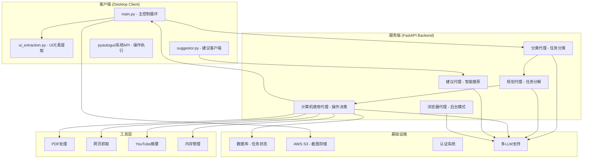
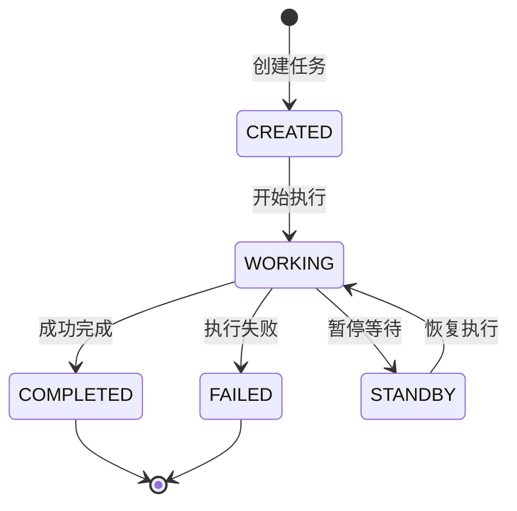

# NeuralAgent 完整桌面自动化系统架构分析

## 系统概述
NeuralAgent 是一个完整的跨平台桌面自动化AI助手系统，采用**客户端-服务端分离架构**，能够理解自然语言指令并自动执行复杂的桌面操作任务。

## 🏗️ 系统架构



## 📱 客户端组件 (Desktop Client)

### 1. 主控制程序 (`main.py`)
**核心职责：** 任务执行循环和桌面操作

#### 🔄 主要工作流
```python
async def main_loop():
    while True:
        # 1. 获取当前子任务
        current_subtask = get_current_subtask()
        
        # 2. 如果任务完成，退出
        if current_subtask.get('action') == 'task_completed':
            break
            
        # 3. 获取下一步操作
        action_response = get_next_step()
        
        # 4. 执行操作
        perform_action(action_response)
```

#### 🖱️ 支持的操作类型
- **鼠标操作：** 左击、右击、双击、三击、拖拽
- **键盘操作：** 按键、组合键、智能Unicode输入
- **应用控制：** 启动应用、切换焦点
- **浏览器控制：** 打开网页
- **系统操作：** 截图、等待、滚动

#### 🧠 智能功能
- **坐标缩放：** 自动适配不同分辨率屏幕
- **Unicode处理：** 智能剪贴板输入解决特殊字符
- **跨平台支持：** Windows、macOS、Linux

### 2. UI元素提取 (`ui_extraction.py`)
**核心职责：** 跨平台UI元素识别和信息提取

#### 🔍 平台特定实现
```python
# Windows: UI Automation
def extract_ui_elements_windows():
    # 使用 uiautomation 库提取UI元素
    
# macOS: Accessibility API  
def extract_ui_elements_macos():
    # 使用 Accessibility API 提取UI元素
    
# Linux: AT-SPI
def extract_ui_elements_linux():
    # 使用 pyatspi 提取UI元素
```

#### 📊 提取的信息
- **元素类型：** 按钮、文本框、复选框、下拉菜单等
- **位置信息：** 精确的边界框坐标
- **文本内容：** 标签、值、标题
- **状态信息：** 是否可见、是否启用

#### 🔍 特殊功能
- **桌面图标识别：** Windows桌面图标提取
- **WebView检测：** 智能识别可能的WebView区域
- **运行应用监控：** 获取当前运行的应用程序列表

### 3. 建议客户端 (`suggestor.py`)
**核心职责：** 获取智能任务建议

## 🚀 服务端组件 (FastAPI Backend)

### 1. 任务处理路由

#### 📋 通用桌面模式 (`generic.py`)
- **当前子任务获取：** `/aiagent/{tid}/current_subtask`
- **下一步操作：** `/aiagent/{tid}/next_step`
- **任务规划：** 自动分解复杂任务为可执行子任务

#### 🌐 后台浏览器模式 (`background.py`)  
- **浏览器操作：** `/aiagent/background/{tid}/next_step`
- **专用于纯浏览器任务**
- **支持标签页管理**

#### 💡 智能建议 (`suggestor.py`)
- **任务推荐：** `/aiagent/suggestor`
- **基于上下文的智能建议**

### 2. AI代理系统 (`ai_prompts.py`)

#### 🎯 分类代理 (Classifier Agent)
```
用户输入 → 分类 → inquiry(询问) / desktop_task(桌面任务)
```
- 判断是否需要浏览器模式
- 检测是否需要后台执行
- 识别扩展思考模式需求

#### 📝 规划代理 (Planner Agent)
```
高级目标 → 分解 → 可执行子任务序列
```
- 将复杂任务分解为逻辑步骤
- 考虑当前运行应用和UI状态
- 生成有序的子任务计划

#### 🖥️ 计算机使用代理 (Computer Use Agent)
```
子任务 + 屏幕状态 → 具体操作指令
```
- **多模态理解：** 结合屏幕截图和UI元素分析
- **上下文感知：** 记忆前序操作和任务历史
- **智能重试：** 验证操作结果并调整策略

#### 🔮 建议代理 (Suggestor Agent)
```
当前状态 → 智能建议 → 用户可能想做的任务
```
- 基于屏幕内容和应用状态
- 考虑用户历史任务偏好
- 生成主动的任务建议

### 3. 工具生态系统 (`agentic_tools.py`)

#### 📄 文档处理工具
- **PDF总结：** `fetch_and_summarize_pdf()`
- **网页抓取：** `fetch_and_summarize_url()`  
- **YouTube分析：** `summarize_youtube_video()`

#### 🧠 记忆管理
- **保存到记忆：** `save_to_memory`
- **跨任务记忆共享**
- **上下文保持**

## 💾 数据模型

### 核心实体关系
```
User (用户)
├── Thread[] (会话线程)
    ├── ThreadTask[] (任务)
        ├── ThreadTaskPlan (执行计划)
        │   └── PlanSubtask[] (子任务 - 按order排序)
        ├── ThreadMessage[] (消息历史)
        └── ThreadTaskMemoryEntry[] (记忆条目)
```

### 任务状态流转


## 🔧 技术栈

### 客户端技术
- **Python核心库：** `pyautogui`, `mss`, `PIL`
- **跨平台UI：** 
  - Windows: `uiautomation`, `pywin32`
  - macOS: `Quartz Accessibility API`
  - Linux: `pyatspi`, `wmctrl`, `xdotool`
- **网络通信：** `requests`

### 服务端技术
- **Web框架：** FastAPI + SQLModel
- **AI集成：** LangChain框架
- **多模型支持：**
  - OpenAI GPT系列
  - Anthropic Claude系列  
  - Google Gemini
  - AWS Bedrock
  - 本地Ollama
- **云服务：** AWS S3存储
- **数据库：** PostgreSQL/MySQL

## 🌟 核心特性

### ✅ 智能理解
- **多模态输入：** 文本指令 + 视觉屏幕分析
- **上下文感知：** 理解当前应用状态和历史操作
- **自然语言处理：** 将复杂描述转换为具体操作

### ✅ 跨平台兼容
- **操作系统：** Windows、macOS、Linux全支持
- **应用程序：** 原生应用、浏览器、WebView
- **分辨率适配：** 自动缩放坐标系统

### ✅ 智能执行
- **任务分解：** 复杂任务自动拆分为可执行步骤
- **状态验证：** 每步操作后验证执行结果
- **错误恢复：** 智能重试和错误处理

### ✅ 安全可控
- **用户授权：** 明确的任务确认机制
- **操作日志：** 完整的执行历史记录
- **隐私保护：** 截图可选存储

## 🎯 应用场景

### 办公自动化
- 📧 **邮件处理：** 批量发送、回复、整理邮件
- 📊 **数据录入：** 表单填写、数据迁移
- 📄 **文档操作：** 格式化、转换、批量处理

### 网络操作
- 🛒 **电商助手：** 商品查找、价格对比、订单管理
- 📱 **社交媒体：** 内容发布、互动管理
- 🔍 **信息收集：** 网页抓取、数据整理

### 系统管理
- ⚙️ **设置配置：** 系统设置、应用配置
- 🗂️ **文件管理：** 批量重命名、整理归档
- 🔄 **任务调度：** 定时任务、批处理操作

### 学习与研究
- 📚 **文档总结：** PDF、网页内容摘要
- 🎥 **视频分析：** YouTube视频内容提取
- 📖 **知识管理：** 信息收集、笔记整理

## 🚀 系统优势

### 1. **架构优雅**
- 客户端-服务端分离，便于扩展和维护
- 模块化设计，职责清晰
- 多代理协作，专业化分工

### 2. **技术先进**
- 多模态AI理解能力
- 支持最新的大语言模型
- 跨平台兼容性强

### 3. **用户友好**
- 自然语言交互
- 智能任务建议
- 可视化操作反馈

### 4. **企业级**
- 完整的用户认证体系
- 任务执行日志和审计
- 云端存储和同步

这是一个功能完整、架构清晰、技术先进的桌面AI自动化解决方案，能够显著提升用户的工作效率和体验。